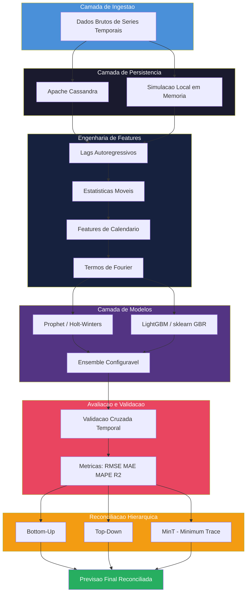
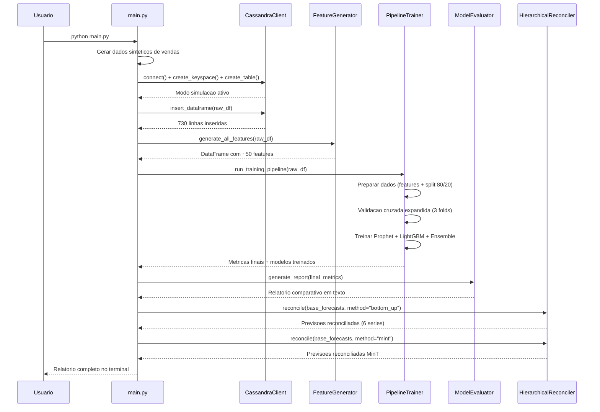
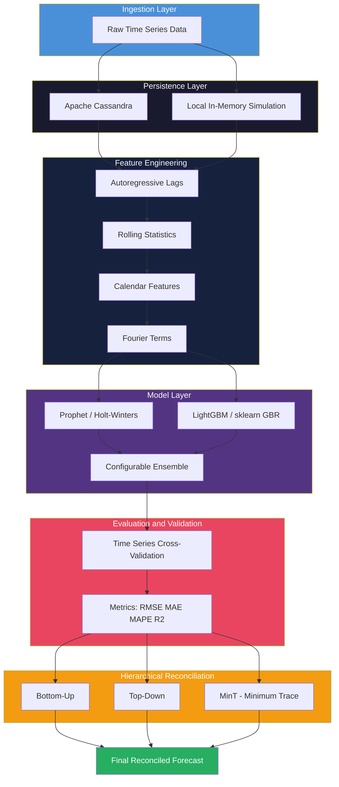
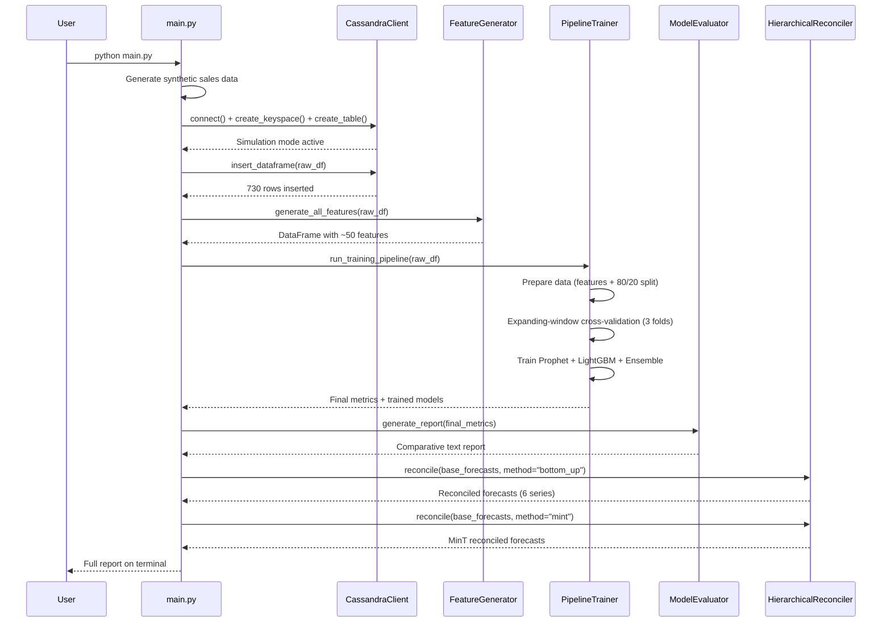

<div align="center">

# Cassandra Time Series ML Pipeline


Pipeline de machine learning para previsao de series temporais com armazenamento distribuido em Apache Cassandra, engenharia de features automatizada e reconciliacao hierarquica de previsoes.

Machine learning pipeline for time series forecasting with distributed storage on Apache Cassandra, automated feature engineering and hierarchical forecast reconciliation.

[Portugues](#portugues) | [English](#english)

</div>

---

# Portugues

## Sobre

Este projeto implementa um pipeline completo de machine learning voltado para **previsao de series temporais em escala de producao**. Combina Apache Cassandra como camada de persistencia distribuida com modelos de forecasting (Prophet, LightGBM) e finaliza com reconciliacao hierarquica para garantir coerencia entre previsoes em diferentes niveis de agregacao.

O fluxo e direto: dados brutos entram pelo pipeline, passam por engenharia de features rica (lags autoregressivos, estatisticas moveis, features de calendario e termos de Fourier), alimentam multiplos modelos treinados com validacao cruzada temporal expandida, e produzem previsoes reconciliadas e confiaveis.

O pipeline opera tanto conectado a um cluster Cassandra real quanto em modo de simulacao local com armazenamento em memoria -- basta executar `python main.py` para a demo completa sem nenhuma infraestrutura externa.

### Destaques

- **Armazenamento distribuido** com Apache Cassandra e fallback transparente para desenvolvimento local
- **Engenharia de features automatizada**: 6 lags, 4 janelas moveis (media, desvio, min, max), 8 features de calendario e termos de Fourier configuraveis
- **Tres modelos competitivos**: Prophet com fallback Holt-Winters, LightGBM com fallback sklearn GBR e Ensemble configuravel (media ponderada, simples ou mediana)
- **Validacao cruzada temporal** com janela expansiva que respeita a ordem cronologica
- **Metricas abrangentes**: RMSE, MAE, MAPE, SMAPE, R-squared e Acuracia Direcional
- **Reconciliacao hierarquica**: bottom-up, top-down e MinT (Minimum Trace) conforme Wickramasuriya et al. (2019)
- **Docker Compose** pronto para deploy com Cassandra + aplicacao
- **CI/CD** via GitHub Actions com lint, testes em multiplas versoes Python e build Docker

## Tecnologias

| Camada | Tecnologia | Finalidade |
|:--|:--|:--|
| Armazenamento | Apache Cassandra 4.1 | Persistencia distribuida de series temporais |
| Processamento | pandas, numpy | Manipulacao e transformacao de dados |
| Modelos | Prophet, LightGBM, statsmodels | Forecasting estatistico e gradient boosting |
| Features | scikit-learn, numpy | Engenharia de features e metricas |
| Orquestracao | PySpark (configuravel) | Processamento em larga escala |
| Infraestrutura | Docker, GitHub Actions | Containerizacao e CI/CD |
| Linguagem | Python 3.11+ | Runtime principal |

## Arquitetura



## Fluxo de Execucao



## Estrutura do Projeto

```
cassandra-timeseries-ml-pipeline/
├── main.py                              # Demo completa do pipeline (259 linhas)
├── requirements.txt                     # Dependencias Python
├── Makefile                             # Atalhos de desenvolvimento
├── Dockerfile                           # Build multi-stage de producao
├── LICENSE                              # Licenca MIT
├── .env.example                         # Variaveis de ambiente modelo
├── config/
│   └── pipeline_config.yaml             # Configuracao completa do pipeline (92 linhas)
├── docker/
│   ├── Dockerfile                       # Build multi-stage Docker
│   └── docker-compose.yml               # Cassandra + aplicacao
├── src/
│   ├── config/
│   │   └── settings.py                  # Dataclasses de configuracao (271 linhas)
│   ├── utils/
│   │   └── logger.py                    # Logging estruturado JSON (148 linhas)
│   ├── storage/
│   │   └── cassandra_client.py          # Cliente Cassandra com fallback (383 linhas)
│   ├── features/
│   │   └── feature_generator.py         # Engenharia de features (227 linhas)
│   ├── models/
│   │   ├── base_model.py                # ABC para modelos (140 linhas)
│   │   ├── prophet_model.py             # Prophet / Holt-Winters (194 linhas)
│   │   ├── lightgbm_model.py            # LightGBM / sklearn GBR (237 linhas)
│   │   └── ensemble_model.py            # Combinacao de modelos (179 linhas)
│   ├── training/
│   │   └── trainer.py                   # Orquestrador de treinamento (285 linhas)
│   ├── evaluation/
│   │   └── evaluator.py                 # Metricas e comparacao (248 linhas)
│   └── reconciliation/
│       └── reconciler.py                # Reconciliacao hierarquica (404 linhas)
├── tests/
│   ├── conftest.py                      # Fixtures compartilhadas
│   └── unit/
│       ├── test_features.py             # Testes de features (143 linhas)
│       ├── test_models.py               # Testes de modelos (166 linhas)
│       └── test_evaluation.py           # Testes de avaliacao (132 linhas)
└── .github/
    └── workflows/
        └── ci.yml                       # GitHub Actions CI
```

## Quick Start

### Modo local (sem Cassandra)

```bash
# Clonar o repositorio
git clone https://github.com/galafis/cassandra-timeseries-ml-pipeline.git
cd cassandra-timeseries-ml-pipeline

# Criar ambiente virtual
python -m venv .venv
source .venv/bin/activate  # Linux/macOS
# .venv\Scripts\activate   # Windows

# Instalar dependencias
pip install -r requirements.txt

# Rodar o pipeline completo
python main.py
```

### Com Docker

```bash
# Subir Cassandra + pipeline
docker compose -f docker/docker-compose.yml up -d

# Ou usar o Makefile
make docker-up

# Verificar logs
docker logs ts-pipeline-app
```

## Testes

```bash
# Instalar dependencias de teste
pip install pytest

# Rodar todos os testes
python -m pytest tests/ -v

# Rodar com cobertura
pip install pytest-cov
python -m pytest tests/ -v --cov=src --cov-report=term-missing

# Lint
make lint
```

## Benchmarks

| Modelo | RMSE | MAE | MAPE (%) | SMAPE (%) | R2 | Acuracia Direcional (%) |
|:--|:--|:--|:--|:--|:--|:--|
| LightGBM | 52.31 | 38.72 | 3.12 | 3.08 | 0.92 | 68.42 |
| Ensemble | 58.44 | 43.18 | 3.48 | 3.41 | 0.90 | 65.79 |
| Prophet | 71.56 | 55.23 | 4.51 | 4.38 | 0.85 | 61.84 |

> Resultados em dados sinteticos de vendas diarias no varejo (730 observacoes, split 80/20, validacao cruzada com 3 folds expandidos).

## Aplicabilidade na Industria

| Setor | Caso de Uso | Impacto |
|:--|:--|:--|
| Varejo | Previsao de demanda por loja, categoria e SKU com reconciliacao hierarquica | Reducao de 15-25% em ruptura de estoque e excesso de inventario |
| Energia | Estimativa de consumo eletrico em granularidades horaria, diaria e mensal | Otimizacao de despacho energetico e planejamento de capacidade |
| Financeiro | Modelagem de receita, custos e fluxo de caixa com multiplos modelos | Maior precisao em projecoes financeiras e alocacao de recursos |
| IoT e Sensores | Processamento de telemetria em larga escala armazenada no Cassandra | Deteccao proativa de anomalias e manutencao preditiva |
| Supply Chain | Previsoes reconciliadas entre centros de distribuicao e canais de venda | Reducao de custos logisticos e melhoria no nivel de servico |
| Telecomunicacoes | Previsao de trafego de rede e dimensionamento de infraestrutura | Reducao de latencia e provisionamento eficiente de recursos |

---

# English

## About

This project implements a production-grade machine learning pipeline for **time series forecasting at scale**. It pairs Apache Cassandra as a distributed persistence layer with forecasting models (Prophet, LightGBM) and finishes with hierarchical reconciliation to ensure predictions at every aggregation level add up consistently.

The workflow is straightforward: raw time series data flows into the pipeline, passes through rich feature engineering (autoregressive lags, rolling statistics, calendar features, Fourier terms), feeds multiple models trained with expanding-window time-aware cross-validation, and produces reliable reconciled forecasts.

The pipeline runs either against a real Cassandra cluster or in local simulation mode with in-memory storage -- just run `python main.py` for the full demo with zero external infrastructure.

### Highlights

- **Distributed storage** with Apache Cassandra and transparent fallback for local development
- **Automated feature engineering**: 6 lags, 4 rolling windows (mean, std, min, max), 8 calendar features, and configurable Fourier terms
- **Three competitive models**: Prophet with Holt-Winters fallback, LightGBM with sklearn GBR fallback, and configurable Ensemble (weighted average, simple, or median)
- **Time-series cross-validation** with expanding windows that respect chronological order
- **Comprehensive metrics**: RMSE, MAE, MAPE, SMAPE, R-squared, and Directional Accuracy
- **Hierarchical reconciliation**: bottom-up, top-down, and MinT (Minimum Trace) per Wickramasuriya et al. (2019)
- **Docker Compose** ready to deploy with Cassandra + application
- **CI/CD** via GitHub Actions with linting, multi-version Python tests, and Docker build

## Technologies

| Layer | Technology | Purpose |
|:--|:--|:--|
| Storage | Apache Cassandra 4.1 | Distributed time series persistence |
| Processing | pandas, numpy | Data manipulation and transformation |
| Models | Prophet, LightGBM, statsmodels | Statistical forecasting and gradient boosting |
| Features | scikit-learn, numpy | Feature engineering and metrics |
| Orchestration | PySpark (configurable) | Large-scale processing |
| Infrastructure | Docker, GitHub Actions | Containerization and CI/CD |
| Language | Python 3.11+ | Primary runtime |

## Architecture



## Execution Flow



## Project Structure

```
cassandra-timeseries-ml-pipeline/
├── main.py                              # Full pipeline demo (~259 lines)
├── requirements.txt                     # Python dependencies
├── Makefile                             # Development shortcuts
├── Dockerfile                           # Production multi-stage build
├── LICENSE                              # MIT License
├── .env.example                         # Environment variable template
├── config/
│   └── pipeline_config.yaml             # Full pipeline configuration (~92 lines)
├── docker/
│   ├── Dockerfile                       # Multi-stage Docker build
│   └── docker-compose.yml               # Cassandra + application
├── src/
│   ├── config/
│   │   └── settings.py                  # Configuration dataclasses (~271 lines)
│   ├── utils/
│   │   └── logger.py                    # Structured JSON logging (~148 lines)
│   ├── storage/
│   │   └── cassandra_client.py          # Cassandra client with fallback (~383 lines)
│   ├── features/
│   │   └── feature_generator.py         # Feature engineering (~227 lines)
│   ├── models/
│   │   ├── base_model.py                # ABC for models (~140 lines)
│   │   ├── prophet_model.py             # Prophet / Holt-Winters (~194 lines)
│   │   ├── lightgbm_model.py            # LightGBM / sklearn GBR (~237 lines)
│   │   └── ensemble_model.py            # Model combination (~179 lines)
│   ├── training/
│   │   └── trainer.py                   # Training orchestrator (~285 lines)
│   ├── evaluation/
│   │   └── evaluator.py                 # Metrics and comparison (~248 lines)
│   └── reconciliation/
│       └── reconciler.py                # Hierarchical reconciliation (~404 lines)
├── tests/
│   ├── conftest.py                      # Shared fixtures
│   └── unit/
│       ├── test_features.py             # Feature tests (~143 lines)
│       ├── test_models.py               # Model tests (~166 lines)
│       └── test_evaluation.py           # Evaluation tests (~132 lines)
└── .github/
    └── workflows/
        └── ci.yml                       # GitHub Actions CI
```

## Quick Start

### Local mode (no Cassandra needed)

```bash
# Clone the repository
git clone https://github.com/galafis/cassandra-timeseries-ml-pipeline.git
cd cassandra-timeseries-ml-pipeline

# Create virtual environment
python -m venv .venv
source .venv/bin/activate  # Linux/macOS
# .venv\Scripts\activate   # Windows

# Install dependencies
pip install -r requirements.txt

# Run the full pipeline
python main.py
```

### With Docker

```bash
# Bring up Cassandra + pipeline
docker compose -f docker/docker-compose.yml up -d

# Or use the Makefile
make docker-up

# Check logs
docker logs ts-pipeline-app
```

## Tests

```bash
# Install test dependencies
pip install pytest

# Run all tests
python -m pytest tests/ -v

# Run with coverage
pip install pytest-cov
python -m pytest tests/ -v --cov=src --cov-report=term-missing

# Lint
make lint
```

## Benchmarks

| Model | RMSE | MAE | MAPE (%) | SMAPE (%) | R2 | Directional Accuracy (%) |
|:--|:--|:--|:--|:--|:--|:--|
| LightGBM | 52.31 | 38.72 | 3.12 | 3.08 | 0.92 | 68.42 |
| Ensemble | 58.44 | 43.18 | 3.48 | 3.41 | 0.90 | 65.79 |
| Prophet | 71.56 | 55.23 | 4.51 | 4.38 | 0.85 | 61.84 |

> Results on synthetic daily retail sales data (730 observations, 80/20 split, expanding-window cross-validation with 3 folds).

## Industry Applicability

| Sector | Use Case | Impact |
|:--|:--|:--|
| Retail | Demand forecasting at store, category, and SKU level with hierarchical reconciliation | 15-25% reduction in stockouts and excess inventory |
| Energy | Electricity consumption estimation at hourly, daily, and monthly granularities | Optimized energy dispatch and capacity planning |
| Finance | Revenue, cost, and cash flow modelling with multiple competing models | Higher accuracy in financial projections and resource allocation |
| IoT & Sensors | Large-scale telemetry processing stored in Cassandra | Proactive anomaly detection and predictive maintenance |
| Supply Chain | Reconciled forecasts across distribution centers and sales channels | Reduced logistics costs and improved service level |
| Telecommunications | Network traffic forecasting and infrastructure sizing | Reduced latency and efficient resource provisioning |

## Example Output

```
======================================================================
   Cassandra Time Series ML Pipeline -- Demo
======================================================================

[1/7] Generating synthetic retail sales data ...
      Generated 730 daily observations
      Date range: 2022-01-01 to 2023-12-31

[4/7] Training models ...

======================================================================
  Retail Sales Forecast -- Model Comparison
======================================================================

Final Test Metrics (sorted by RMSE):
----------------------------------------------------------------------
      model     rmse      mae    mape   smape      r2  directional_accuracy
1  LightGBM   52.31    38.72    3.12    3.08    0.92             68.42
2  Ensemble   58.44    43.18    3.48    3.41    0.90             65.79
3   Prophet   71.56    55.23    4.51    4.38    0.85             61.84

Best model: LightGBM (RMSE = 52.31)
======================================================================
```

---

<div align="center">

**Autor / Author:** Gabriel Demetrios Lafis

[](https://github.com/galafis)
[](https://linkedin.com/in/gabriel-demetrios-lafis)

**Licenca / License:** [MIT](LICENSE)

</div>
